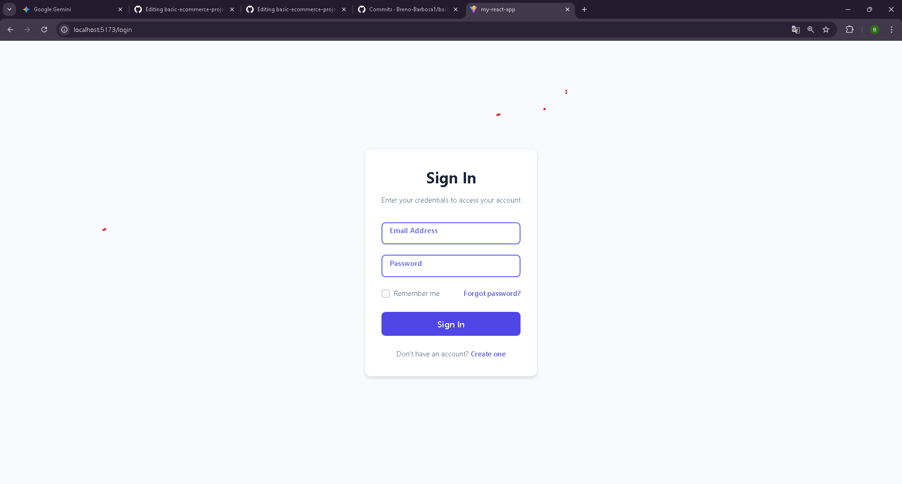
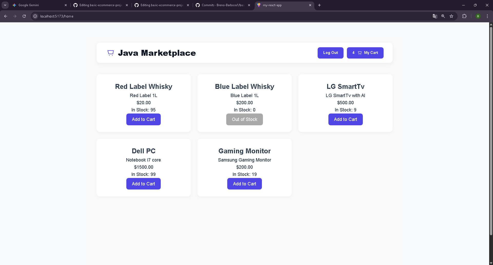
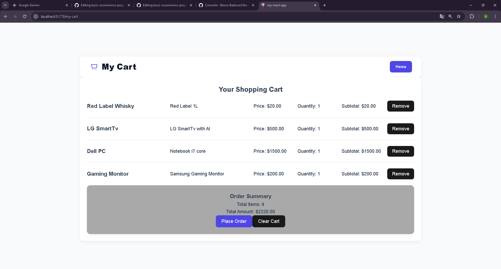

# 🛒 Basic E-Commerce Project
**Full-Stack RESTful API & Frontend: Spring Boot + React + TypeScript (Personal Study Project)**

Hello! This is a personal study project that I started developing back in September 2025. It provided a massive learning experience for me on how Spring Boot and REST APIs work. I also learned about Spring Security and how to secure an API with authentication and authorization via JWT tokens. Furthermore, I learned how to integrate my backend with React + TypeScript using a MySQL database and how to test it with Integration tests and JUnit. So far, it's been a rewarding and challenging experience!

### 🛠 Technologies used:
* ✅ **Spring Boot 3.5.6**
* ✅ **Java 21**
* ✅ **Unit tests** with JUnit and Mockito
* ✅ **Integration Tests** with Testcontainers
* ✅ **Swagger**
* ✅ **JWT Authentication** (Roles, Tokens)
* ✅ **React + TypeScript**
* ✅ **Database migrations** with Flyway
* ✅ **HATEOAS & DTOs**

### 🧠 Lessons Learned:
* ☑️ **Spring Security:** I now have a grasp on JWT Tokens, Roles, Authentication, and Authorization. It proved to be a major challenge due to its complexity.
* ☑️ **Frontend Integration:** Integration with React was the most time-consuming phase due to various bugs (Incorrect JSON, URL resource paths, CORS, etc.).

> **Note:** I used AI models for the CSS Styling to prioritize the actual project logic and backend code.

---

## 📸 Screenshots

| Sign In | Product Marketplace | Shopping Cart |
| :---: | :---: | :---: |
|  |  |  |

---

## 🚀 How to Run

### Prerequisites
* ✅ **Java 21** or higher
* ✅ **Maven 3.8+** (or use the provided `mvnw` wrapper)
* ✅ **Node.js (v18+)** and **npm**
* ✅ **MySQL Server**

### 1. Database Setup
1.  Create a MySQL database named `basic_ecommerce`.
2.  Configure your credentials in `basic-ecommerce-backend/src/main/resources/application.yml`.
    * *Note: Flyway handles table creation and data seeding automatically.*

### 2. Run backend at the terminal:
	cd basic-ecommerce-backend
	./mvnw clean spring-boot:run

### 3. Run frontend on a new terminal:
	cd basic-ecommerce-frontend
	npm install
	npm run dev
Note: The React application will typically be available at http://localhost:5173 (standard Vite port).

### 4. Run the tests:
	cd basic-ecommerce-backend
	./mvnw test
 Note: Here you can verify the system integrity through the integration tests (using Testcontainers and JUnit).
